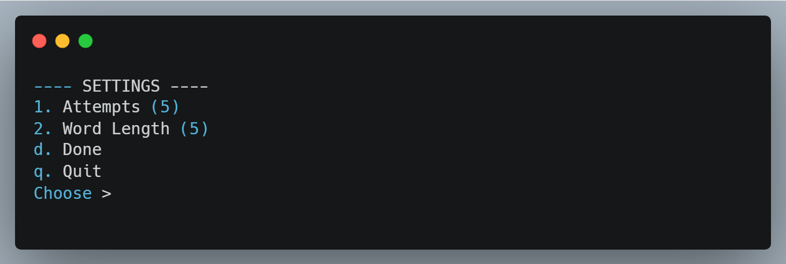
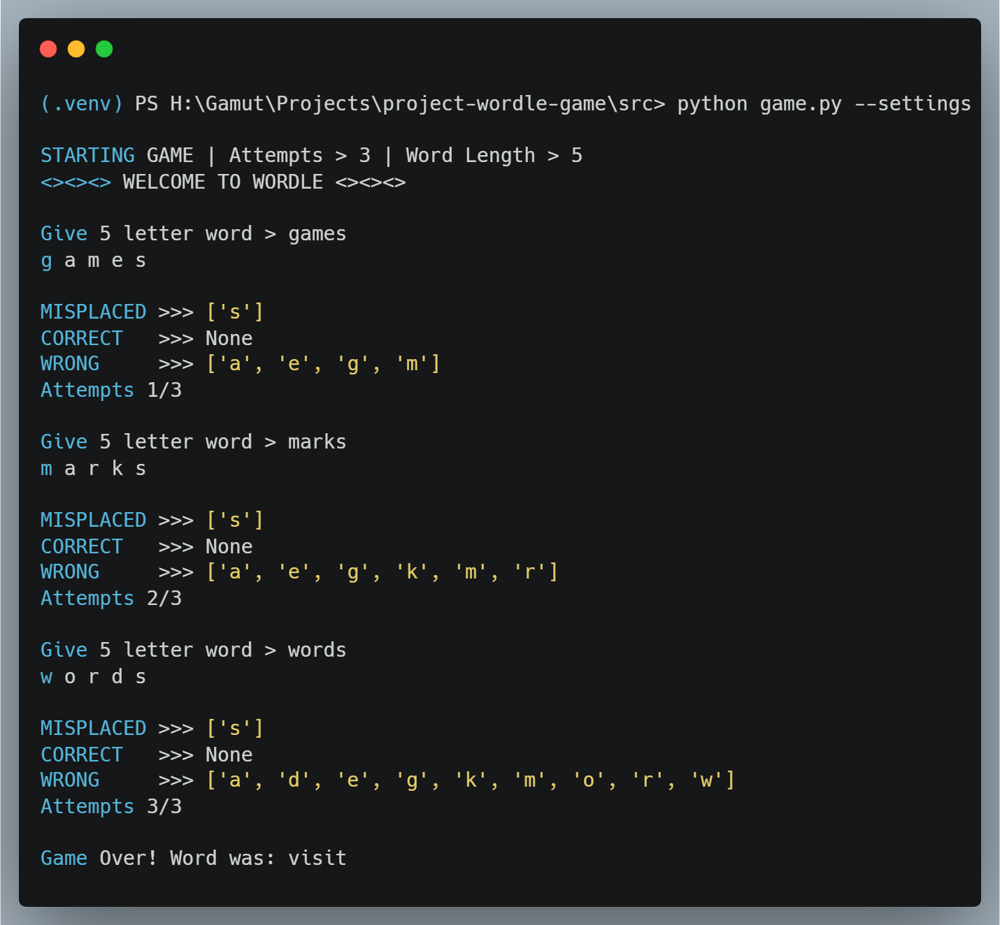

<div align="center">
A simple, colorful terminal-based recreation of the classic Wordle game, powered by Python.
This version supports custom attempts, custom word length, color-coded feedback, and CLI flags for quick control.
</div>

---
## Features

* Play Wordle directly in your terminal
* Adjustable **attempts** and **word length**
* Color-coded hints:

  * 🟩 **Green** → Correct letter, correct position
  * 🟨 **Yellow** → Correct letter, wrong position
  * 🟥 **Red** → Letter not in the word
* Displays unused, wrong, misplaced, and correct letters
* Supports quick commands like `--help`, `--quit`, and `--settings`


## Requirements

Make sure you have the required libraries installed:

```bash
pip install -r requirements.txt
```


## **Syntax**

Run the program from the terminal:

```bash
python src\main.py [--start] [--settings] [--help]
```

### **Available Flags**

| Flag         | Description                                                           |
| ------------ | --------------------------------------------------------------------- |
| `--start`    | Start the game using default settings (5 attempts, 5-letter word).    |
| `--settings` | Let you change the number of attempts and word length before playing. |
| `--help`     | Displays help & instructions.                                         |


## **Settings Mode**

If you choose:

```bash
python src\main.py --settings
```

You can configure:

* **Attempts:** up to 10
* **Word Length:** 5 to 8 letters

Commands inside settings mode:



---

## **How to Play**

To start the game :

```bash
python src\main.py --start
```
It will start the game with default settings : **Attempts 5 | Word Length 5**

During the game:

* Enter a word with the exact required length.
* Type `--quit` anytime to exit and reveal the hidden word.
* Type `--help` anytime to print the help menu.

You will see:

* 🟩 **Correct letters**
* 🟨 **Misplaced letters**
* 🟥 **Wrong letters**
* A list of **unused letters**

The game ends when:

* You guess the correct word 
* OR you exhaust all attempts 


## **Example Gameplay Output**





## **Notes**

* Words are generated using the **wonderwords** library.
* Color output works on most modern terminals.


## **License**

This project is open-source and free to use.

---

